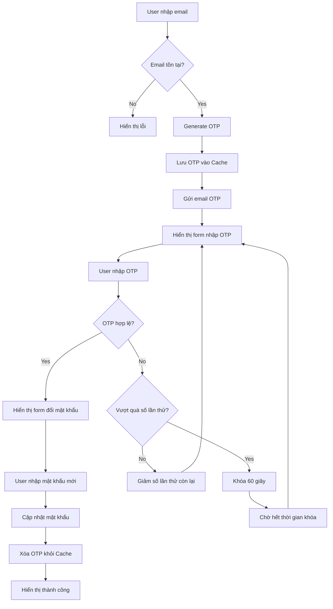

# 🔐 Forgot Password Flow - Best Practices & Architecture

## 📋 Tổng Quan

Hệ thống quên mật khẩu được thiết kế theo kiến trúc clean code với các nguyên tắc SOLID, đảm bảo tính bảo mật cao và dễ bảo trì.

## 🏗️ Kiến Trúc Hệ Thống

### 📁 Cấu Trúc Thư Mục
```
app/
├── Http/
│   ├── Controllers/Auth/
│   │   └── ForgotPasswordController.php      // Main Controller
│   ├── Requests/Auth/                        // Form Request Validation
│   │   ├── SendOtpRequest.php
│   │   ├── VerifyOtpRequest.php
│   │   └── ResetPasswordRequest.php
│   └── Middleware/
│       └── ForgotPasswordMiddleware.php      // Route Protection
├── Services/Auth/                            // Business Logic Layer
│   ├── OtpService.php                       // OTP Management
│   └── ForgotPasswordService.php            // Main Service
├── Mail/Auth/
│   └── SendOtpMail.php                      // Email Template
├── Enums/
│   └── OtpConstants.php                     // Configuration Constants
├── Exceptions/
│   └── OtpException.php                     // Custom Exception Handling
└── Models/
    └── User.php                             // User Model
```

## 🔄 Flow Diagram



## 🛡️ Tính Năng Bảo Mật

### 1. **OTP Security**
- **Độ dài**: 5 chữ số
- **Thời gian sống**: 1 phút
- **Số lần thử tối đa**: 5 lần
- **Thời gian khóa**: 60 giây sau khi vượt quá số lần thử

### 2. **Session Management**
- Sử dụng Laravel Session để theo dõi trạng thái
- Tự động hết hạn session khi hoàn thành flow
- Kiểm tra session hợp lệ ở mỗi bước

### 3. **Rate Limiting**
- Giới hạn số lần gửi OTP
- Cooldown period giữa các lần gửi
- Theo dõi attempts per email

## 📝 Chi Tiết Implementation

### 1. **Constants & Configuration**

```php
// app/Enums/OtpConstants.php
class OtpConstants
{
    const OTP_LENGTH = 5;                    // Độ dài OTP
    const OTP_EXPIRY_MINUTES = 1;           // Thời gian hết hạn (phút)
    const MAX_ATTEMPTS = 5;                 // Số lần thử tối đa
    const COOLDOWN_SECONDS = 60;            // Thời gian khóa (giây)
    
    const OTP_CACHE_PREFIX = 'otp_';        // Prefix cho cache key
    const ATTEMPTS_CACHE_PREFIX = 'otp_attempts_';
}
```

### 2. **Service Layer Architecture**

#### **OtpService** - Quản lý OTP
```php
class OtpService
{
    // Core Methods
    public function generateOtp(string $email): string
    public function verifyOtp(string $email, string $inputOtp): bool
    public function clearOtp(string $email): void
    public function getRemainingTime(string $email): int
    
    // Private Helper Methods
    private function createRandomOtp(): string
    private function storeOtp(string $email, string $otp): void
    private function isOtpExpired(array $storedData): bool
    private function incrementAttempts(string $email, array $storedData): void
}
```

#### **ForgotPasswordService** - Business Logic
```php
class ForgotPasswordService
{
    public function sendOtpToEmail(string $email): bool
    public function verifyUserOtp(string $email, string $otp): bool
    public function resetUserPassword(string $email, string $newPassword): bool
    public function userExists(string $email): bool
}
```

### 3. **Exception Handling**

```php
// app/Exceptions/OtpException.php
class OtpException extends Exception
{
    // Factory Methods
    public static function expired()
    public static function invalid($attemptsLeft = 0)
    public static function maxAttemptsReached($cooldownSeconds = 60)
}
```

### 4. **Form Request Validation**

```php
// Tách validation logic ra khỏi controller
class SendOtpRequest extends FormRequest
{
    public function rules(): array
    public function messages(): array
    public function getEmail(): string
}
```

## 🔄 Flow Steps Chi Tiết

### **Bước 1: Nhập Email**
- **Route**: `GET /password/reset`
- **View**: `auth.passwords.email`
- **Validation**: Email format + tồn tại trong DB
- **Action**: Redirect đến bước 2

### **Bước 2: Gửi OTP**
- **Route**: `POST /password/email`
- **Process**: 
  1. Generate OTP 5 chữ số
  2. Lưu vào Cache với TTL = 1 phút
  3. Gửi email
  4. Redirect với session email

### **Bước 3: Xác Thực OTP**
- **Route**: `GET /password/verify-otp`
- **View**: `auth.passwords.verify-otp`
- **Features**:
  - Countdown timer hiển thị thời gian còn lại
  - Button "Gửi lại" với cooldown
  - Hiển thị số lần thử còn lại

### **Bước 4: Đặt Lại Mật Khẩu**
- **Route**: `GET /password/reset-form`
- **View**: `auth.passwords.reset`
- **Validation**: Password confirmation + strength
- **Security**: Hash password trước khi lưu

### **Bước 5: Hoàn Thành**
- **Route**: `GET /password/success`
- **View**: `auth.passwords.success`
- **Action**: Clear tất cả session data

## 🎨 Frontend Features

### 1. **Real-time Feedback**
```javascript
// Countdown timer cho OTP expiry
function startCountdown(seconds) {
    const timer = setInterval(() => {
        if (seconds <= 0) {
            clearInterval(timer);
            showResendButton();
        }
        updateTimerDisplay(seconds--);
    }, 1000);
}

// Auto-submit khi nhập đủ 5 số
function handleOtpInput(input) {
    if (input.value.length === 5) {
        submitOtpForm();
    }
}
```

### 2. **User Experience**
- **Loading states**: Hiển thị spinner khi gửi email
- **Error handling**: Toast notifications cho lỗi
- **Progress indicator**: Hiển thị bước hiện tại
- **Auto-focus**: Tự động focus vào input tiếp theo

## 📧 Email Template

### **Thiết Kế Email OTP**
```html
<!-- resources/views/emails/auth/send-otp.blade.php -->
<div class="email-container">
    <h2>🔐 Mã Xác Thực OTP</h2>
    <div class="otp-code">{{ $otp }}</div>
    <p>Mã có hiệu lực trong <strong>1 phút</strong></p>
    <p class="warning">⚠️ Không chia sẻ mã này với bất kỳ ai</p>
</div>
```

## ⚙️ Configuration

### 1. **Cache Configuration**
```php
// config/cache.php
'stores' => [
    'otp' => [
        'driver' => 'redis', // Hoặc 'file' cho development
        'connection' => 'default',
        'prefix' => 'otp_cache',
    ],
],
```

### 2. **Mail Configuration**
```php
// .env
MAIL_MAILER=smtp
MAIL_HOST=smtp.gmail.com
MAIL_PORT=587
MAIL_USERNAME=your-email@gmail.com
MAIL_PASSWORD=your-app-password
MAIL_ENCRYPTION=tls
```

### 3. **Routes Setup**
```php
// routes/web.php
Route::prefix('password')->name('password.')->group(function () {
    Route::get('/reset', [ForgotPasswordController::class, 'showEmailForm'])->name('request');
    Route::post('/email', [ForgotPasswordController::class, 'sendOtp'])->name('email');
    Route::get('/verify-otp', [ForgotPasswordController::class, 'showOtpForm'])->name('verify-otp');
    Route::post('/verify-otp', [ForgotPasswordController::class, 'verifyOtp']);
    Route::get('/reset-form', [ForgotPasswordController::class, 'showResetForm'])->name('reset');
    Route::post('/reset', [ForgotPasswordController::class, 'resetPassword']);
    Route::get('/success', [ForgotPasswordController::class, 'showSuccessPage'])->name('success');
    
    // API Routes
    Route::post('/resend-otp', [ForgotPasswordController::class, 'resendOtp'])->name('resend-otp');
});
```

## 🧪 Testing Strategy

### 1. **Unit Tests**
```php
// tests/Unit/Services/OtpServiceTest.php
class OtpServiceTest extends TestCase
{
    public function test_generate_otp_creates_5_digit_code()
    public function test_verify_otp_with_valid_code()
    public function test_otp_expires_after_timeout()
    public function test_max_attempts_lockout()
}
```

### 2. **Feature Tests**
```php
// tests/Feature/ForgotPasswordTest.php
class ForgotPasswordTest extends TestCase
{
    public function test_complete_forgot_password_flow()
    public function test_invalid_email_returns_error()
    public function test_expired_otp_redirects_to_start()
}
```

## 📊 Monitoring & Logging

### 1. **Log Events**
```php
// Log các sự kiện quan trọng
Log::info("OTP generated for email: {$email}");
Log::warning("Invalid OTP attempt for email: {$email}");
Log::error("Failed to send OTP email: {$email}");
```

### 2. **Metrics Tracking**
- Số lượng OTP được gửi mỗi ngày
- Tỷ lệ thành công của flow
- Thời gian trung bình hoàn thành
- Số lần thử OTP trung bình

## 🚀 Deployment Checklist

### **Production Ready**
- [ ] Cấu hình SMTP production
- [ ] Setup Redis cho cache
- [ ] Configure rate limiting
- [ ] Setup monitoring alerts
- [ ] Test email delivery
- [ ] Verify SSL certificates
- [ ] Setup backup strategy
- [ ] Configure log rotation

## 🔧 Maintenance & Updates

### **Regular Tasks**
1. **Weekly**: Kiểm tra log errors
2. **Monthly**: Review security metrics
3. **Quarterly**: Update dependencies
4. **Yearly**: Security audit

### **Performance Optimization**
- Cache email templates
- Optimize database queries
- Use queue for email sending
- Implement CDN for static assets

## 🎯 Best Practices Summary

1. **🔒 Security First**: Luôn ưu tiên bảo mật
2. **📝 Clean Code**: Code dễ đọc, dễ maintain
3. **🧪 Test Coverage**: Test đầy đủ các scenarios
4. **📊 Monitoring**: Theo dõi hiệu suất liên tục
5. **🔄 Scalability**: Thiết kế có thể mở rộng
6. **👥 User Experience**: UX mượt mà và intuitive
7. **📋 Documentation**: Tài liệu chi tiết và cập nhật
8. **🛡️ Error Handling**: Xử lý lỗi graceful

---

## 📞 Support & Contact

Để được hỗ trợ về hệ thống này, vui lòng liên hệ team development hoặc tạo issue trong repository.

**Created**: $(date)  
**Version**: 1.0  
**Last Updated**: $(date)  
**Author**: Development Team
