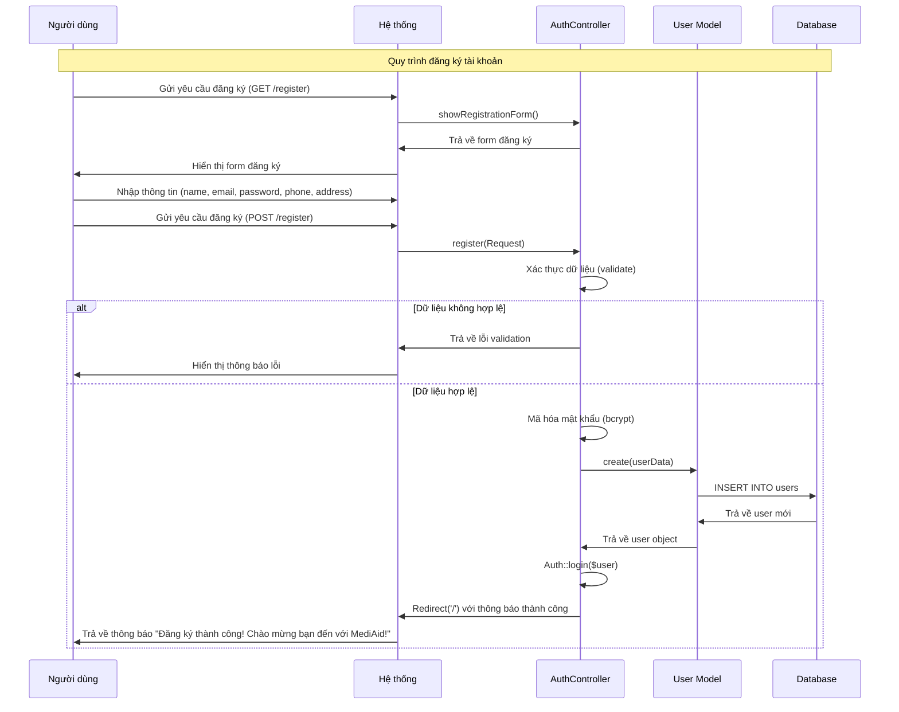

# Sơ đồ tuần tự - Chức năng đăng ký tài khoản

## Mô tả
Sơ đồ tuần tự mô tả quy trình đăng ký tài khoản người dùng trong hệ thống.

## Sơ đồ Mermaid



## Sơ đồ văn bản (Text-based)

```
┌─────────────┐         ┌─────────────┐         ┌─────────────┐         ┌─────────────┐
│ Người dùng  │         │  Hệ thống   │         │AuthController│         │User Model  │
└──────┬──────┘         └──────┬──────┘         └──────┬──────┘         └──────┬──────┘
       │                      │                       │                       │
       │ 1. Gửi yêu cầu       │                       │                       │
       │    đăng ký           │                       │                       │
       │─────────────────────>│                       │                       │
       │                      │                       │                       │
       │                      │ 2. showRegistrationForm()                      │
       │                      │──────────────────────>│                       │
       │                      │                       │                       │
       │                      │ 3. Trả về form       │                       │
       │                      │<──────────────────────│                       │
       │                      │                       │                       │
       │ 4. Hiển thị form     │                       │                       │
       │    đăng ký           │                       │                       │
       │<─────────────────────│                       │                       │
       │                      │                       │                       │
       │ 5. Nhập thông tin     │                       │                       │
       │    (name, email,      │                       │                       │
       │     password, phone,  │                       │                       │
       │     address)          │                       │                       │
       │                      │                       │                       │
       │ 6. Gửi yêu cầu       │                       │                       │
       │    đăng ký           │                       │                       │
       │    (POST /register)  │                       │                       │
       │─────────────────────>│                       │                       │
       │                      │                       │                       │
       │                      │ 7. register(Request)  │                       │
       │                      │──────────────────────>│                       │
       │                      │                       │                       │
       │                      │ 8. Xác thực dữ liệu   │                       │
       │                      │    (validate)         │                       │
       │                      │                       │                       │
       │                      │                       │ 9. Mã hóa mật khẩu    │
       │                      │                       │    (bcrypt)           │
       │                      │                       │                       │
       │                      │                       │ 10. create(userData)  │
       │                      │                       │──────────────────────>│
       │                      │                       │                       │
       │                      │                       │ 11. INSERT INTO users │
       │                      │                       │                       │
       │                      │                       │ 12. Trả về user mới   │
       │                      │                       │<──────────────────────│
       │                      │                       │                       │
       │                      │                       │ 13. Auth::login($user)│
       │                      │                       │                       │
       │                      │ 14. Redirect('/')    │                       │
       │                      │    với thông báo      │                       │
       │                      │    thành công         │                       │
       │                      │<──────────────────────│                       │
       │                      │                       │                       │
       │ 15. Trả về thông báo  │                       │                       │
       │     "Đăng ký thành   │                       │                       │
       │     công! Chào mừng   │                       │                       │
       │     bạn đến với       │                       │                       │
       │     MediAid!"        │                       │                       │
       │<─────────────────────│                       │                       │
       │                      │                       │                       │
```

## Chi tiết các bước

1. **Người dùng gửi yêu cầu đăng ký**: Người dùng truy cập route `/register` (GET request)
2. **Hệ thống hiển thị form**: AuthController trả về view `auth.register` với form đăng ký
3. **Người dùng nhập thông tin**: Điền các trường:
   - Họ và tên (name) - bắt buộc
   - Email - bắt buộc, phải unique
   - Mật khẩu (password) - bắt buộc, tối thiểu 8 ký tự, phải có xác nhận
   - Số điện thoại (phone) - bắt buộc, 10-11 chữ số
   - Địa chỉ (address) - tùy chọn
4. **Người dùng gửi form**: Submit form với method POST đến route `/register`
5. **Hệ thống xác thực dữ liệu**: AuthController validate các trường theo rules đã định nghĩa
6. **Xử lý dữ liệu**: Nếu hợp lệ:
   - Mã hóa mật khẩu bằng bcrypt
   - Tạo mảng userData với role mặc định là 'user'
7. **Tạo tài khoản**: User Model tạo record mới trong database
8. **Đăng nhập tự động**: Hệ thống tự động đăng nhập user vừa tạo
9. **Trả về kết quả**: Redirect về trang chủ với thông báo thành công

## Các trường hợp lỗi

- **Email đã tồn tại**: "Email đã được sử dụng"
- **Mật khẩu không khớp**: "Xác nhận mật khẩu không khớp"
- **Mật khẩu quá ngắn**: "Trường mật khẩu phải có ít nhất 8 ký tự"
- **Số điện thoại không hợp lệ**: "Số điện thoại phải có 10-11 chữ số"
- **Thiếu trường bắt buộc**: Hiển thị thông báo lỗi tương ứng

## File liên quan

- `app/Http/Controllers/Auth/AuthController.php` - Controller xử lý đăng ký
- `app/Models/User.php` - Model User
- `resources/views/auth/register.blade.php` - View form đăng ký
- `routes/web.php` - Định nghĩa routes đăng ký

